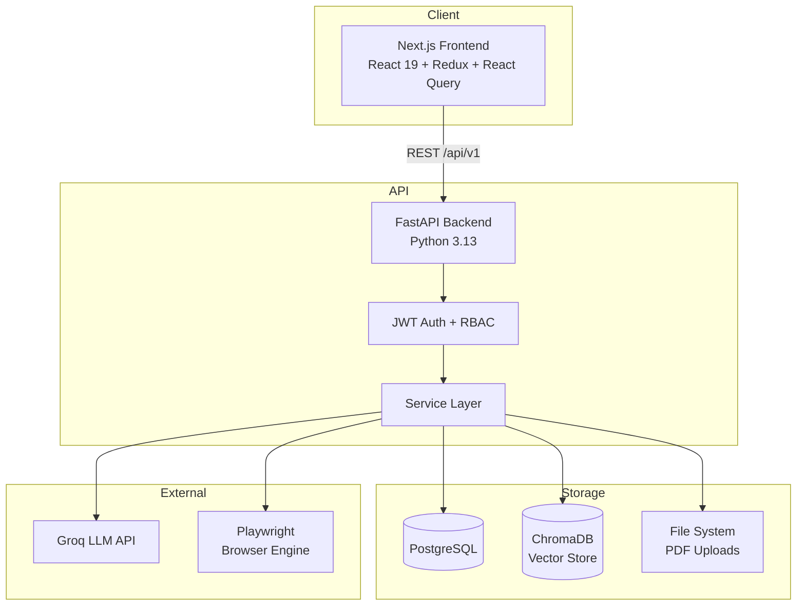
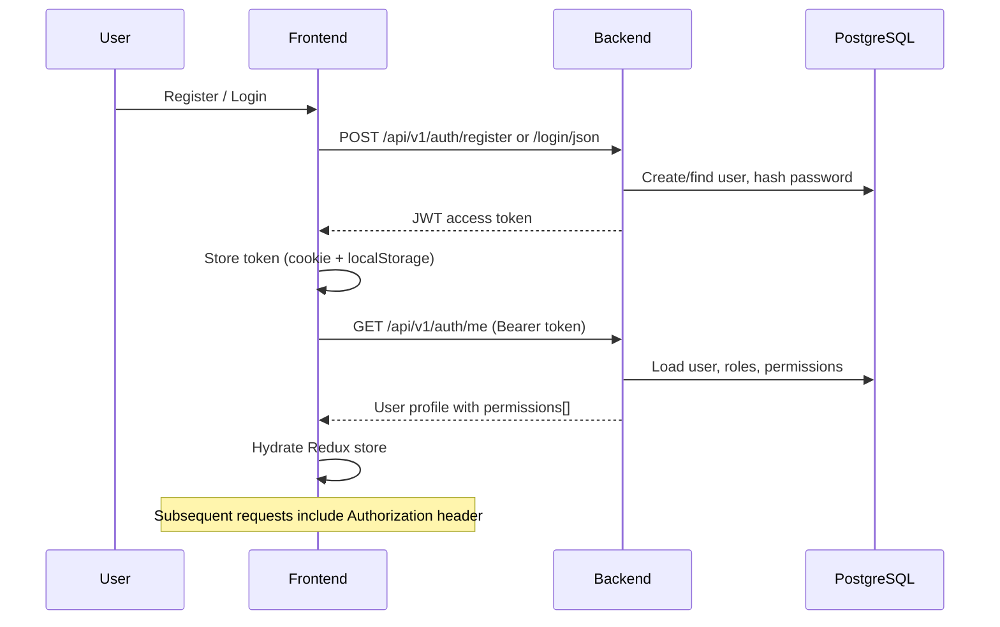
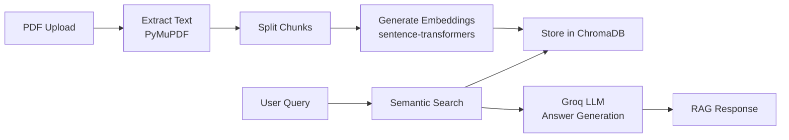
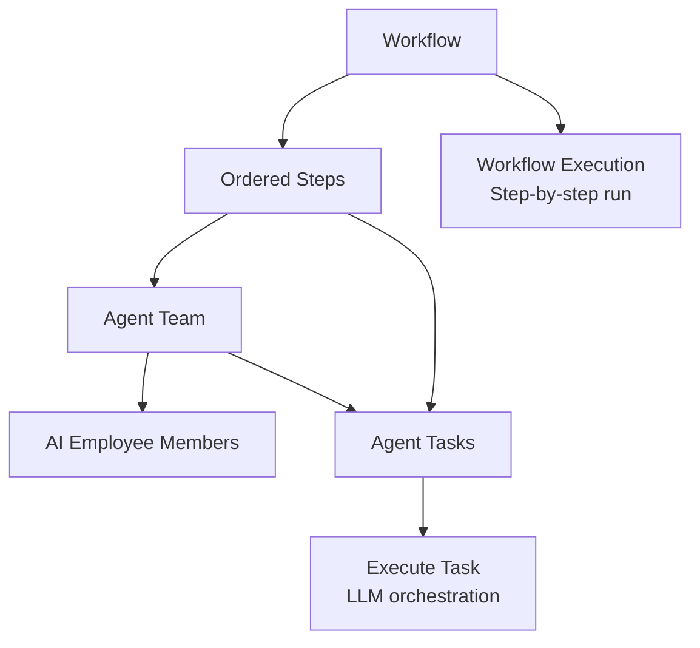

# Architecture Overview

High-level system design for the AI Enterprise Automation Platform.

## System Diagram



## Layered Backend Architecture

```
Request → API Endpoints → Dependencies (JWT + permissions) → Services → Models/DB
```

| Layer | Location | Responsibility |
|-------|----------|----------------|
| Endpoints | `app/api/v1/endpoints/` | HTTP routing, request validation, response serialization |
| Dependencies | `app/api/deps.py` | JWT extraction, current user resolution |
| Authorization | `app/core/authorization.py` | Permission checks per endpoint |
| Services | `app/services/` | Business logic, orchestration |
| Models | `app/models/` | SQLAlchemy ORM entities |
| Schemas | `app/schemas/` | Pydantic input/output types |

## Frontend Architecture

```
Page (App Router) → Component → React Query Hook → API Service → fetch client
                                      ↓
                              Redux (auth token, user)
```

| Layer | Location | Responsibility |
|-------|----------|----------------|
| Pages | `src/app/` | Route definitions, thin wrappers |
| Components | `src/components/{module}/` | UI rendering, state orchestration |
| Hooks | `src/hooks/` | React Query queries/mutations |
| API services | `src/lib/api/` | Typed HTTP calls per module |
| Config | `src/config/` | Navigation, module constants |
| Store | `src/store/` | Auth session, app hydration, UI state |

## Multi-Tenancy

Every resource is scoped to an `organization_id`:

- Users belong to one organization
- All CRUD operations filter by the authenticated user's organization
- Registration creates a new organization (or joins an existing one via invite slug)
- Default roles (`admin`, `member`) and 42 permissions are seeded on org creation

## Authentication Flow



### Auth Layers

1. **Middleware** (`middleware.ts`) — server-side cookie check, redirects unauthenticated users
2. **AuthGuard** — client-side guard after Redux hydration
3. **API Bearer token** — every authenticated API call
4. **Backend JWT validation** — `deps.py` decodes and validates on every protected endpoint

## Permission Model (RBAC)

```
User → UserRole → Role → RolePermission → Permission (slug)
```

- 42 permission slugs (e.g., `users:read`, `workflows:write`)
- Permissions enforced server-side on every endpoint
- Frontend gates UI actions via `hasPermission(permissions, PERMISSIONS.*)`
- Organization admin role (`admin` slug) has elevated access for org profile edits

## Knowledge Base / RAG Pipeline



## AI Employee Architecture

- Each employee has: system prompt, model config, assigned knowledge documents, assigned tools
- Chat creates conversations with message history
- RAG retrieval uses employee's assigned knowledge scope
- Activate/deactivate controls availability

## Agent Teams & Workflows



## Research Hub

- Project-based research with templates
- Execution pipeline: plan → search → synthesize → report
- Reports exportable as Markdown and PDF
- Org-level analytics and report aggregation

## Browser Automation

- **Profiles:** browser configuration (user agent, viewport, cookies)
- **Tasks:** scripted browser actions (navigate, click, extract)
- **Execution:** Playwright-driven headless browser runs
- Analytics on task success/failure rates

## Analytics Architecture

No unified analytics backend. The frontend aggregates data from multiple sources:

| Analytics page | Data sources |
|---------------|-------------|
| Overview | `/api/v1/dashboard/overview` |
| Organization | users, departments, teams, roles, permissions list APIs |
| Knowledge | documents list API |
| AI Employees | employees list API |
| Agent Teams | agent-teams + agent-tasks APIs |
| Workflows | workflows + executions APIs |
| Research | research-projects analytics endpoint |
| Browser | browser-tasks analytics endpoint |
| Reports | research reports aggregation |

Partial 403 responses are handled gracefully via `fetch-optional.ts` — restricted sections show badges instead of blocking the entire page.

## Data Persistence

| Store | Technology | Contents |
|-------|-----------|----------|
| PostgreSQL | SQLAlchemy | Users, orgs, IAM, documents metadata, employees, workflows, research, browser tasks |
| ChromaDB | Local filesystem | Document chunk embeddings |
| File system | Local directory | Uploaded PDF files |

## Deployment Topology

### Local Development

```
┌─────────────┐     ┌─────────────┐     ┌─────────────┐
│  Frontend   │────▶│   Backend   │────▶│  PostgreSQL │
│  :3000      │     │  :8000      │     │  :5432      │
└─────────────┘     └──────┬──────┘     └─────────────┘
                           │
                    ┌──────┴──────┐
                    │  Local dirs │
                    │ uploads/    │
                    │ chroma_data/│
                    └─────────────┘
```

### Production Recommendations

- Reverse proxy (nginx/Caddy) with TLS termination
- Separate managed PostgreSQL (Neon, RDS)
- Persistent volumes for uploads and ChromaDB
- Environment-specific CORS and API URLs
- Multiple uvicorn workers for backend
- CDN for frontend static assets

## API Versioning

All endpoints are under `/api/v1`. Future versions would use `/api/v2` with a separate router.

## Error Handling

- Backend: centralized exception handlers in `app/core/exception_handlers.py`
- Integrity errors (duplicate slugs, FK violations) mapped to 409/400
- Permission denials return 403 with descriptive messages
- Frontend: `getApiErrorMessage()` normalizes errors for display
