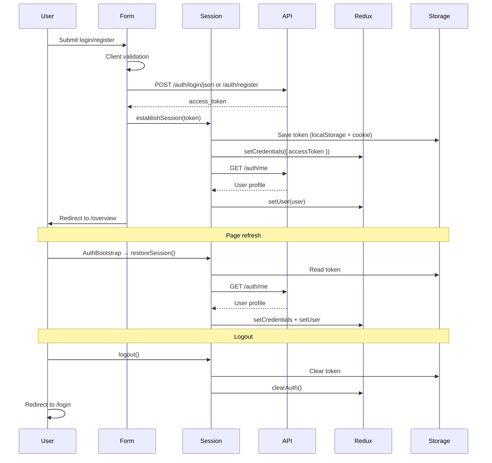

# Authentication Integration (Phase 1)

## Auth flow



### Register

1. User submits the register form with name, email, password, and organization name.
2. Client-side validation runs (required fields, email format, password length 8–128).
3. `POST /api/v1/auth/register` creates the user and organization, returns a JWT.
4. Session is established: token stored, `/me` fetched, Redux updated.
5. User is redirected to `/overview`.

### Login

1. User submits email and password.
2. Client-side validation runs.
3. `POST /api/v1/auth/login/json` returns a JWT.
4. Session is established the same way as register.
5. User is redirected to `/overview`.

### Session restore (auto login on refresh)

1. `AuthBootstrap` runs on app load inside `Providers`.
2. Token is read from `localStorage`.
3. If present, `GET /api/v1/auth/me` validates it and loads the user profile.
4. On failure (expired/invalid token), storage and Redux are cleared.
5. `app.isHydrated` is set to `true` so guards can render.

### Protected routes

- **Middleware** (`src/middleware.ts`): redirects unauthenticated requests away from `/overview` to `/login`; redirects authenticated users away from `/login` and `/register` to `/overview`.
- **AuthGuard** (`src/components/auth/auth-guard.tsx`): client-side guard on the dashboard layout; waits for hydration, then redirects to `/login` if not authenticated.
- **GuestGuard** (`src/components/auth/guest-guard.tsx`): on auth pages, redirects authenticated users to `/overview`.

### Logout

No backend logout endpoint exists. Logout is client-side only:

1. Clear `localStorage` token and auth cookie.
2. Dispatch `clearAuth()` in Redux.
3. Redirect to `/login`.

---

## API endpoints used

| Endpoint | Method | Purpose | Auth required |
|----------|--------|---------|---------------|
| `/api/v1/auth/register` | POST | Create account + org, returns JWT | No |
| `/api/v1/auth/login/json` | POST | Login with JSON body, returns JWT | No |
| `/api/v1/auth/me` | GET | Current user profile | Bearer token |

### Not available (backend)

| Endpoint | Status |
|----------|--------|
| Refresh token | Not implemented — JWT expires after 60 minutes; user must log in again |
| Logout | Not implemented — client clears token locally |

### Request / response shapes

**Register** (`POST /api/v1/auth/register`):

```json
{
  "email": "user@example.com",
  "password": "password123",
  "first_name": "Jane",
  "last_name": "Smith",
  "organization_name": "Acme Corp"
}
```

**Login** (`POST /api/v1/auth/login/json`):

```json
{
  "email": "user@example.com",
  "password": "password123"
}
```

**Token response** (register + login):

```json
{
  "access_token": "<jwt>",
  "token_type": "bearer"
}
```

**Current user** (`GET /api/v1/auth/me`):

```json
{
  "id": "uuid",
  "email": "user@example.com",
  "first_name": "Jane",
  "last_name": "Smith",
  "organization_id": "uuid",
  "organization_name": "Acme Corp",
  "organization_slug": "acme-corp",
  "is_active": true,
  "roles": [{ "id": "uuid", "name": "Administrator", "slug": "admin" }],
  "permissions": ["users:read", "..."],
  "created_at": "2026-06-12T00:00:00"
}
```

Base URL: `NEXT_PUBLIC_API_URL` (default `http://localhost:8000`).

---

## Redux structure

### `auth` slice (`src/store/slices/auth-slice.ts`)

| Field | Type | Description |
|-------|------|-------------|
| `accessToken` | `string \| null` | JWT for API requests |
| `user` | `User \| null` | Profile from `/me` |
| `isAuthenticated` | `boolean` | `true` when a valid session exists |

**Actions:**

- `setCredentials({ accessToken, user? })` — set token after login/register/restore
- `setUser(user)` — set profile after `/me`
- `clearAuth()` — logout / invalid session

### `app` slice (`src/store/slices/app-slice.ts`)

| Field | Type | Description |
|-------|------|-------------|
| `isHydrated` | `boolean` | `true` after auth bootstrap completes |

Used by route guards to avoid redirecting before the stored session is restored.

---

## Files created / modified

### Created

| File | Purpose |
|------|---------|
| `src/lib/auth/constants.ts` | Token storage keys and cookie name |
| `src/lib/auth/storage.ts` | `localStorage` + cookie read/write/clear |
| `src/lib/auth/validation.ts` | Login/register form validation |
| `src/lib/auth/session.ts` | Login, register, restore, logout orchestration |
| `src/lib/api/auth.ts` | Auth API functions |
| `src/lib/api/errors.ts` | Parse backend error responses |
| `src/components/auth/auth-bootstrap.tsx` | Restore session on app load |
| `src/components/auth/auth-guard.tsx` | Protect dashboard routes |
| `src/components/auth/guest-guard.tsx` | Redirect logged-in users from auth pages |
| `src/middleware.ts` | Server-side route protection |
| `docs/auth-integration.md` | This document |

### Modified

| File | Change |
|------|--------|
| `src/components/auth/login-form.tsx` | Wired submit, validation, API, errors, redirect |
| `src/components/auth/register-form.tsx` | Wired submit, validation, API, errors, redirect |
| `src/components/dashboard/dashboard-header.tsx` | Logout clears session and redirects to `/login` |
| `src/app/providers.tsx` | Added `AuthBootstrap` |
| `src/app/(dashboard)/layout.tsx` | Wrapped with `AuthGuard` |
| `src/app/(auth)/layout.tsx` | Wrapped with `GuestGuard` |

### Unchanged (already in place)

| File | Role |
|------|------|
| `src/store/slices/auth-slice.ts` | Auth state shape and reducers |
| `src/lib/api/client.ts` | Shared `fetch` client with Bearer token support |
